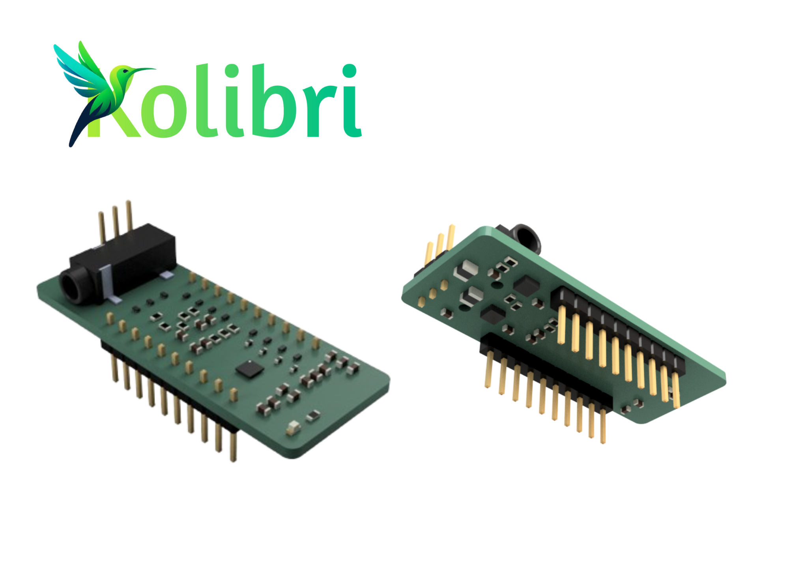
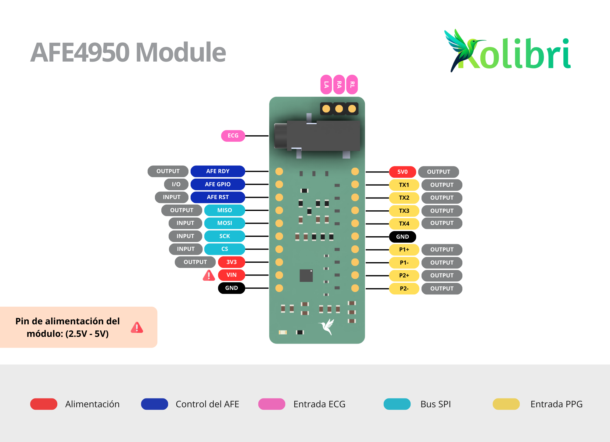

# AFE4950 Library for Arduino

An Arduino-compatible library designed to interface the Analog Front End (AFE) AFE4950 — an ultra-compact, high-precision biomedical acquisition IC — with ESP32, nRF52840, and other microcontrollers. This library enables real-time acquisition of ECG (electrocardiogram) and PPG (photoplethysmogram) signals, making it ideal for both research and embedded healthcare applications.

## AFE4950 Module

The AFE4950 Module is a specialized board built for biosignal acquisition with:

* **High-precision signal chain components**
* **Electrostatic discharge (ESD) protection**
* **High-frequency noise filtering (EMI protection)**

These features ensure robust, clean signal acquisition and improve overall reliability, even in demanding environments.

> While intended for development, the AFE4950 Module is also suitable for integration into production-ready devices.




---

## What’s New in v2.0.0

This version introduces major architectural improvements:

* **Structured ring buffer integration**: Internally implemented circular buffer for efficient, non-blocking sample storage.
* **Modular ISR handling**: Optional use of `IRAM_ATTR` optimized for ESP32.
* **Protocol tagging and packetization**: Data packets include headers and sample tags (ECG/PPG identifiers).
* **Improved object-oriented design**: Allows for better encapsulation and portability.

> **Deprecated**: Functions like `ready()`, `getData()` and `getBytesToSend()` have been removed in favor of `availableBytes()`, `readByte()`, and `readBytes()` for a more efficient pull-based interface.

---

## Features

* Simultaneous acquisition of ECG and PPG in a 3:1 pattern (ECG, ECG, PPG...)
* Interrupt-driven FIFO readout and SPI transfer
* Configurable sampling frequency (e.g., 500 Hz ECG / 250 Hz PPG)
* Clean buffer separation between acquisition and transmission
* Platform-compatible with ESP32, nRF52840, and other MCUs

---

## Getting Started

### 1. Install the Library

Use Arduino Library Manager to search for `AFE4950` and install the latest version.

### 2. Include the Header

```cpp
#include <AFE4950.h>
```

### 3. Connect the AFE4950 Module

Follow the pinout diagram to wire up the SPI interface and control lines (RESET, FIFO\_RDY).

### 4. Run an Example

Examples include:

* `RawPacket-ECG-PPG-Streaming.ino`: Streams raw 224-byte data packets
* `Separated-ECG-PPG-Decoder.ino`: Extracts and prints voltage values for each ECG/PPG sample

---

## Requirements

* **Arduino IDE >= 1.8.13** or **PlatformIO**
* Compatible hardware (ESP32, nRF52840, STM32, etc.)
* AFE4950 Module with SPI wiring and signal interface

## Documentation

* [API Reference](docs/api.md)
* [Example Use Cases](examples/)
* [Register Configuration Details](src/Registers.h)

For questions or feedback, contact: [jjlondonocarrillo@gmail.com](mailto:jjlondonocarrillo@gmail.com)
