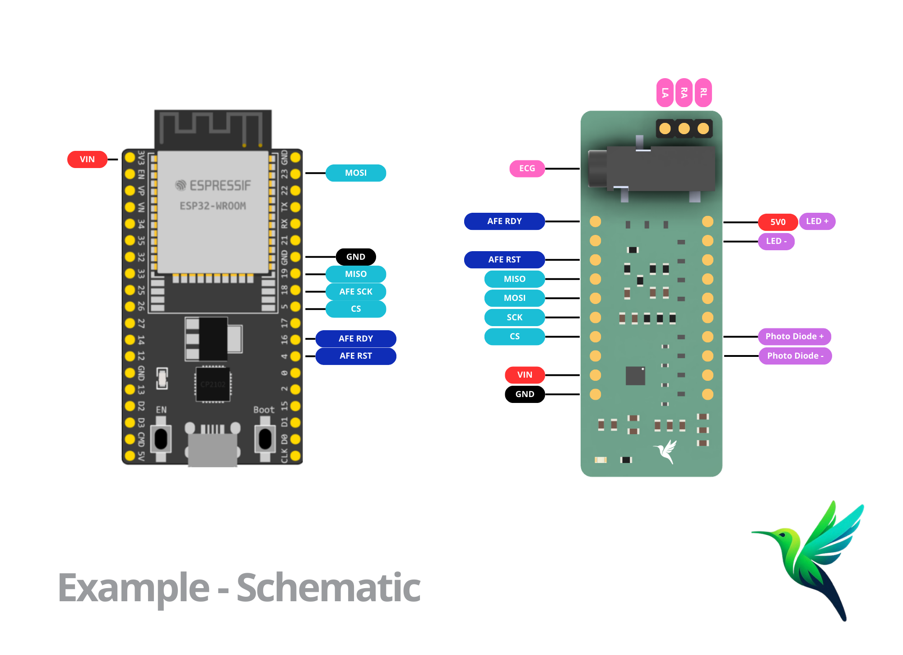

# AFE4950 ECG & PPG decode data Example

Acquire and convert into voltage single-channel ECG and PPG signals simultaneously using the AFE4950 module and an ESP32 as the host microcontroller.
This example demonstrates how to configure the AFE4950 to capture ECG and PPG signals at sampling rates of 500 Hz and 250 Hz, respectively.  
The AFE4950 is configured to trigger a FIFO ready interrupt once 54 samples are available.
Each acquisition cycle produces a structured sequence of samples organized as follows:
- ECG sample
- ECG sample
- PPG sample
- [...]
Captured data packets (224 bytes each) are parsed directly on the microcontroller to extract and separate the ECG and PPG signals.  
The extracted signals are then transmitted over the Serial port (configured at 115200 baud).
Data acquisition can be controlled dynamically by sending the following commands through the Serial monitor:
- `"start"`: Begin acquisition
- `"stop"`: Stop acquisition
This example focuses on **local processing** of the captured data within the microcontroller, contrasting with raw packet streaming examples intended for external processing.

## Hardware Required

* ESP32 microcontroller
* AFE4950 module
* ECG lead cables (for Jack connector or RA, LA, RL pins)
* PPG sensor (LED and Photodiode)
* Hook-up wires

## Circuit

### ECG Connections
1. **RA (Right Arm)**: Connect to pin RA on the AFE4950 module.
2. **LA (Left Arm)**: Connect to pin LA on the AFE4950 module.
3. **RL (Right Leg - ground/reference)**: Connect to pin RL on the AFE4950 module.

### PPG Sensor Connections
- **LED**:
  - **Anode**: Connect to the 5V pin on the AFE4950 module.
  - **Cathode**: Connect to TX1 on the AFE4950 module.
- **Photodiode**:
  - **Anode**: Connect to P1+ on the AFE4950 module.
  - **Cathode**: Connect to P1- on the AFE4950 module.

### Schematic

## Commands

| Command | Description        |
|---------|--------------------|
| `start` | Begins data capture |
| `stop`  | Ends data capture   |

## Code Explanation

This example initializes the AFE4950 by configuring the appropriate sampling rates and FIFO interrupt settings.  
The microcontroller listens for Serial commands to control the start and stop of data acquisition.
Captured data is stored in a buffer, with a FIFO ready interrupt triggering each time the AFE4950 accumulates 54 samples (the configured watermark level).  
Once a complete packet is received, the raw data is parsed directly on the microcontroller to extract individual ECG and PPG samples.  
The extracted signals are then transmitted in real time to the Arduino Serial Monitor for external or consumption.
This example demonstrates local processing of the data within the microcontroller.

## Example Use Case: Vital Signs Monitor

This library can be utilized as a foundation to build a comprehensive vital signs monitoring system. Using the AFE4950 and an ESP32, physiological signals like ECG and PPG can be acquired in real-time and transmitted to a computer for visualization and analysis.

In this example setup, the acquired signals are processed and displayed on a custom PC interface, providing real-time feedback on heart rate calculated from both PPG and ECG.

